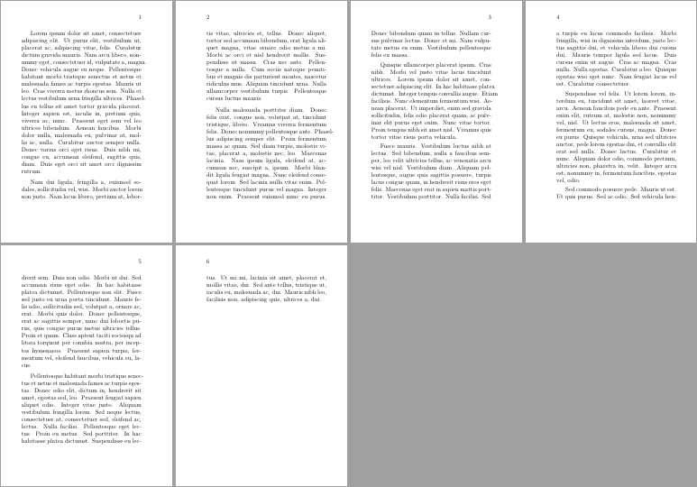
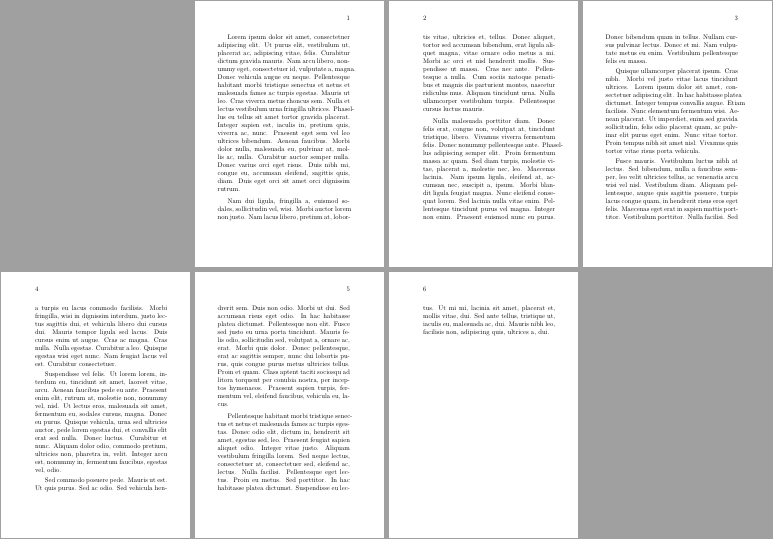

# Viewing a document (pdf)
<!--
**TODO** internal/external 
how to switch to windowed/external
-->
## Internal pdf viewer

TeXstudio has an internal (built-in) pdf viewer that lets you view your
pdf documents. The viewer can be embedded or window-based (in a separate
window). The former uses an area to the right of the editor, the latter
uses its own window and gives the user more options. The viewer can be
opened by clicking the View button or by pressing the `F7` key.


### Forward and Inverse searching

In this section you will not learn how to find a specific text, as you
know it from other editors. Searching is different: If you see something
in your pdf document that you want to change, then you need to figure
out where to change your LaTeX document in the editor (inverse search).
Or you want to figure out where your changed text will be displayed in
the pdf (forward search). 

```{note}
Make sure that synctex is activated in the pdflatex command (option -synctex=1
needs to be added), though TeXstudio will ask you if it can correct the
command itself if it is not set correctly.
```

Forward search is automatically done every time the pdf-viewer is
opened. TeXstudio will jump to the position where your cursor is
currently positioned. Additionally you can use CTRL+left mouse button
click on a word in the text editor to jump to the pdf or use the context
menu and select \"Go To PDF\".

Inverse search can be activated by clicking in the pdf with CTRL+left
mouse button or by selecting \"jump to source\" in the context menu,
which is activated with a right mouse button click.

Furthermore it is possible to enable \"Scrolling follows Cursor\" in
pdf-viewer/configure. This will keep the pdf-viewer position synchronous
to your cursor opposition in the editor. Likewise \"Cursor follows
Scrolling\" keeps the editor position synchronous to pdf-viewer
position.

### Modes and mouse actions

You can choose main mode *Magnify* or *Scroll* from the toolbar. The
mouse cursor used is a magnifier glass, or an open hand. 


These offer following actions:

Magnify mode only

-   left mouse button click opens magnifier showing enlarged part of the
    text, or follows a link
-   Shift + left mouse button click increases zoom level
-   Alt + left mouse button click decreases zoom level

Scroll mode only

-   left mouse button click grabs the document so you can scroll it
    around, or follows a link
-   double left mouse button click opens magnifier showing enlarged part
    of the text
-   Shift + left mouse button click sets grid page offset (s. [Special features](#changing-the-grid-page-offset))

Magnify and Scroll mode

-   Ctrl + left mouse button click jumps to the source (inverse search)
-   Ctrl + Shift + left mouse button click copies coordinates to
    clipboard (s. [Special features](#copy-page-coordinates-to-the-clipboard))

```{note}
-   When you set option Presentation (menu View, or key F5), the
    windowed pdf viewer only uses left and right mouse button click to
    scroll pages forth and back, and pressing the mouse wheel button
    changes the cursor into a red laser dot.
-   With option Full Screen set (menu View, or key Ctrl+Shift+F) the
    windowed pdf viewer\'s behavior is that of Scroll Mode.
-   The mouse cursor hot spot of the magnifier glass lies in the center
    of the glass, that of the open hand is marked with a small cross
    outside the hand. This may help improve accuracy of inverse search.
```

### Changing the grid page offset

The windowed pdf viewer arranges the pages in a customizable grid of
columns and rows (s. menu View/Grid) in which the pages are placed. The
first page may be placed on the left in the first row (i.e. a grid page
offset of 0) and the following pages fill the row and so on:



A grid page offset of 0 may not be suitable in all cases. For example,
if you are working on a book, since books have odd pages on the right.
The first page of the document shown in the previous image should be
positioned in the second or forth column (i.e. a grid page offset of 1
or 3). Thus each grid row starts with an even (left) page and ends with
an odd (right) page (if appropriate):



To meet this requirement, you can manually change the offset for the
first page in any grid. To do this, use Shift + left mouse button click
on any place of the grid while in Scroll mode. The first page will be
moved to the place that is in the first row and in the same column as
the place you selected with the mouse. You may frequently use grid 2x1
with 2 columns to view books. In this case, for the sake of simplicity,
the first page is automatically shifted to the right (i.e. an offset of
1 is set).

```{hint}
When option Single Page Step (menu View/Grid) is set, a manually
set grid page offset gets ignored.
```

### Copy page coordinates to the clipboard

You can also use the pdf viewer to get the x and y coordinates of a
point on a page by performing Ctrl + Shift + left mouse button click
(the mouse cursor changes to a cross) at that point. By doing so, the x
and y coordinates of the mouse position (in centimeters) with respect to
the bottom left corner of the current page are copied into your
clipboard.

Example for x, y copied to clipboard: 10.16, 12.8372

This becomes particularly useful when adjusting margins or working with
TikZ.

## Preview
When optimizing small structures visually like tables or formulas, various compilation runs may be necessary to reach a final state. Compiling a large document may take longer, so that is inconvenient for these tasks.

TeXstudio offers a preview for this circumstance.
The preview can either be inline, i.e. right below the previewed text, as tooltip, in the preview pane or in the embedded pdf viewer.
The selection is done in the [configuration](configuration.md#configuring-preview).

### Inline Preview

The inline preview is started with selecting the interesting text and then pressing `Alt+p` or using the context menu on the selection. An inline preview can be closed with context menu (right-click) on the preview.

```{tab} Preview context menu

```

```{tab} Resulting inline preview

```

```{tab} Context menu on inline preview

```

### Tooltip preview
A tooltip is created when hovering over the delimiters like `$` of a formula.
It takes a moment until the preview can be presented as it is compiled when the preview is started.

The preview is also available for colors and images.

```{tab} preview math

```

```{tab} preview color

```

```{tab} preview image

```